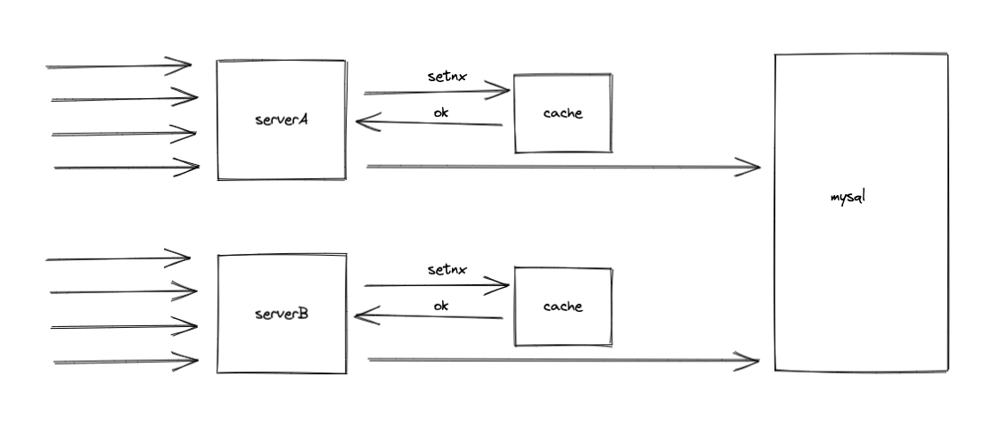

# scache
一个基于golang的内存缓存， 目前在api优化过程中，发现存在很大部分工程师不会编写分布式锁，或者说不会用redis
构建一个分布式锁，当然使用redis的分布式锁天然也存在一些问题，导致锁并不是特别可靠。我就有想法编写一个基于内存
的scache提供单机版本的锁，以插件形式引入到程序本地去，整体请求流程如下，当然server和cache交互都是在一个程序
中的。

可以知道的是在同一时间可能存在多个请求打到数据库，但是这个取决于每台服务器的策略，整体1000个请求，同时两个请求
到数据库也是可以容忍的。

除此之外，还有一个需求是部分的内容很多工程师喜欢存到内存，在使用golang开发的时候这种情况特别明显，所以在这种情况
下，万一某个部分没有处理好，导致内存泄露以及其他不可预测的情况是业务不友好的，所以必须要在这个基础上实现一个内存
管理的功能。